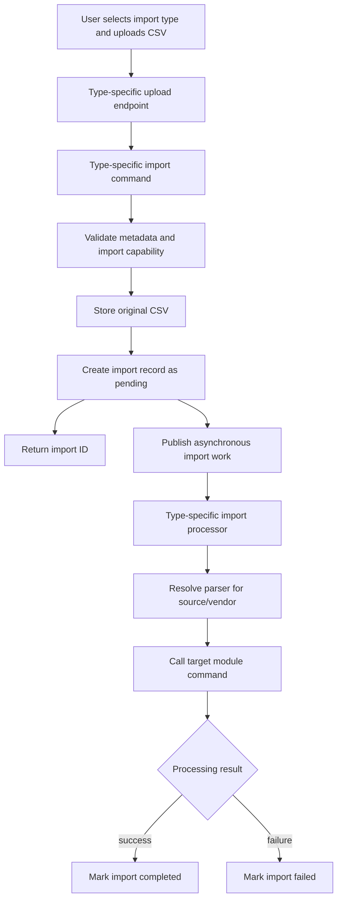
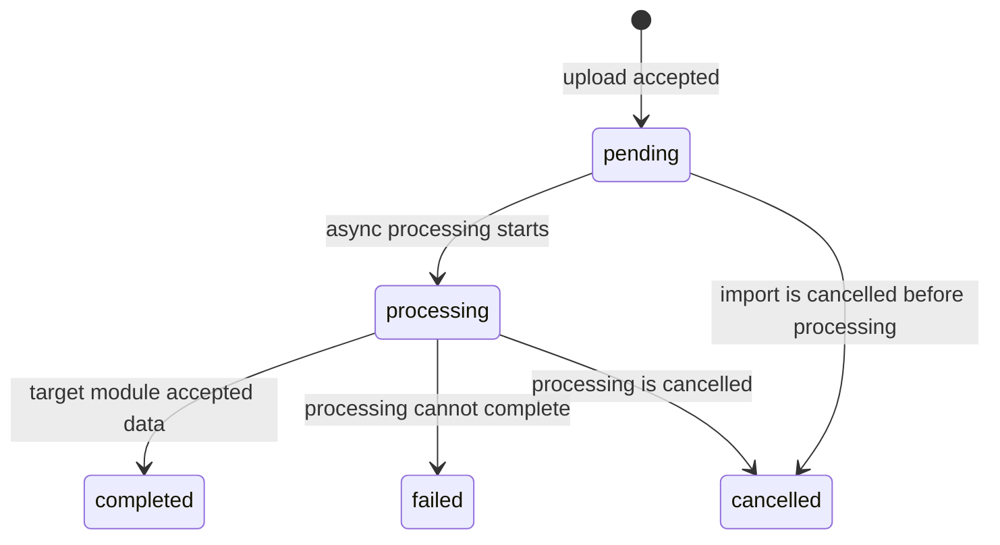

# [002] CSV Imports

## Overview

CSV imports let users upload supported CSV files and process them asynchronously without blocking the request that accepts the file. The feature covers three explicit import types:

- cashflow transaction imports
- portfolio transaction imports
- end-of-day market data imports

Each import type has its own HTTP endpoint, handler, and application command. The import layer provides the shared mechanics: accept the upload, store the original file, create a durable import record, publish work for asynchronous processing, and track the import lifecycle.

## Import Types

| Type | User Intent | Import Responsibility | Target Module Responsibility |
| --- | --- | --- | --- |
| Cashflow | Import bank/payment transactions from a vendor CSV. | Parse the selected vendor format and submit cashflow transaction data. | Create cashflow transactions and apply existing cashflow deduplication rules. |
| Portfolio | Import broker/investment transactions from a vendor CSV. | Parse the selected broker format and submit portfolio transaction data. | Create portfolio transactions, apply existing portfolio deduplication rules, and own any rebuild behavior. |
| EOD | Import daily market data from a CSV source. | Parse daily price rows and submit EOD data. | Provide the command that creates market data records and applies marketdata validation/deduplication rules. |

Users choose the import type explicitly by using the matching endpoint. The system should not infer cashflow versus portfolio versus EOD from the uploaded file alone.

## Entry Points

Each import type should expose a separate multipart upload endpoint and command. Exact route names can follow the API's route conventions, but the feature shape is:

- cashflow CSV import endpoint -> cashflow CSV import command
- portfolio CSV import endpoint -> portfolio CSV import command
- EOD CSV import endpoint -> EOD CSV import command

All endpoints accept a CSV file plus the metadata needed by that import type, such as account, vendor, listing, provider, or source identifiers. Type-specific validation belongs in the corresponding command before the import is accepted.

The upload action is a commit-and-process action. There is no preview, staging, or manual approval step in this feature.

## Shared Flow

The three import types follow this same lifecycle even though they call different target modules.

## Import Lifecycle

Supported statuses are:

- `pending`: the file is accepted and waiting to be processed
- `processing`: asynchronous processing has started
- `completed`: the import finished successfully
- `failed`: the import could not be processed successfully
- `cancelled`: the import was intentionally stopped before completion

The import record stores the original file reference, import type, lifecycle status, timestamps, status message, and available result counters. A failed import should keep enough failure information to explain what went wrong.

## Processing Rules

Import processing is asynchronous. The request that uploads the CSV should return after the file and import record are durably stored, not after every CSV row is processed.

Parsers convert source-specific CSV rows into records suitable for the target module. Parsers do not own final persistence, deduplication policy, portfolio rebuilds, or marketdata business rules.

The target modules remain authoritative for domain behavior:

- cashflow creates cashflow transactions directly; there is no staging flow
- portfolio creates portfolio transactions and owns any portfolio rebuild behavior
- marketdata provides the command for creating EOD data
- existing deduplication logic remains the source of truth for duplicate detection

If processing fails, including a row-level failure that prevents the target module from accepting the import, the import is marked `failed`. The feature does not include a `completed_with_errors` status.

## Events

The import layer publishes asynchronous work after an import is accepted. Processing may publish completion or failure events so other parts of the application can react, but consumers should treat those events as notifications rather than the place where import business rules live.

Portfolio rebuild behavior is outside the import feature. If portfolio imports should cause rebuilds, that decision belongs to the portfolio module.

## Out of Scope

- import preview or staged review before committing rows
- import status/read APIs and UI polling
- defining new deduplication rules
- portfolio rebuild implementation
- marketdata command internals for creating EOD records
